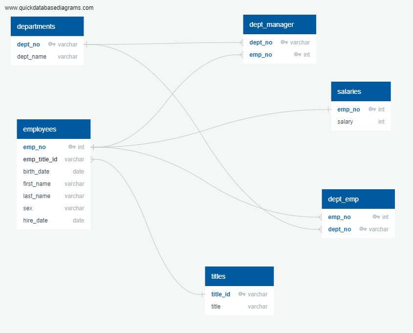
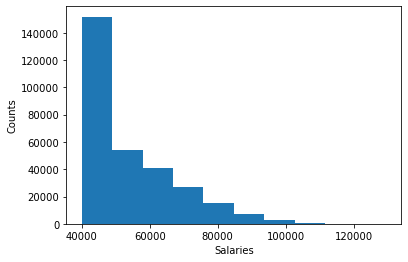

# SQL-Challenge

# Data Engineering:

Here the data is inspected and the 'Entity Relational Diagram' ERD is sketched.

# Data Analysis: 

--- Here the results are analyzed by:

1. Querying the details of each employee: employee number, last name, first name, sex, and salary and the below is the screen shot of the result.

2. Querying first name, last name, and hire date for employees who were hired in 1986.

3. Querying the manager of each department with the following information: department number, department name, the manager's employee number, last name, first name. 

4. Querying the department of each employee with the following information: employee number, last name, first name, and department name. 

5. Querying first name, last name, and sex for employees whose first name is "Hercules" and last names begin with "B." 

6. Querying all employees in the Sales department, including their employee number, last name, first name, and department name.

7. Querying all employees in the Sales and Development departments, including their employee number, last name, first name, and department name. 

8. Querying the frequency count of employee last names, i.e., how many employees share each last name in descending order.

# Bonus:

 1. Create a histogram to visualize the most common salary ranges for employees.

 

2. Create a bar chart of average salary by title.

